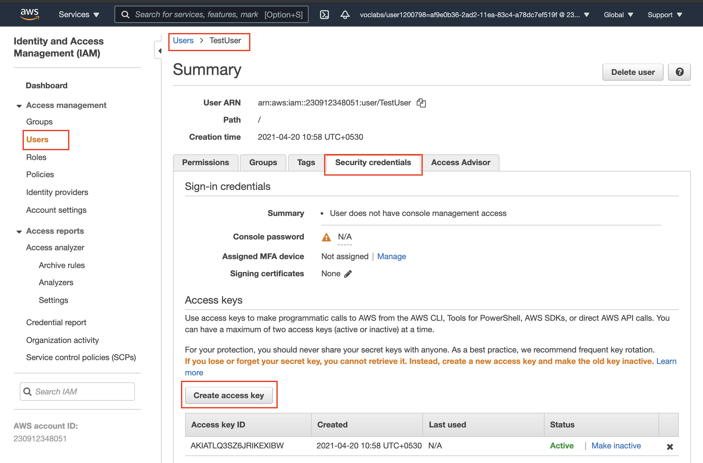

## Prerequisite Steps:

### 1. Create a new IAM user
IAM service is a global service, meaning newly created IAM users are not restricted to a specific region by default.
- Go to [AWS IAM service](https://console.aws.amazon.com/iam/home#/users) and click on the "**Add user**" button to create a new IAM user in your AWS account. 
- Choose a name of your choice. 
- Select "*Programmatic access*" as the access type. Click Next. 
- Choose the *Attach existing policies directly* tab, and select the "**AdministratorAccess**". Click Next. 
- Skip adding any tags. Click Next. 
- Review and create the user. It will show you a pair of access key ID and secret.
- Take note of the pair of access key ID and secret. This pair is collectively known as **Access key**. 

<center>
<br><br>
Snapshot of a pair of an Access key
</center>

### <font color='red'>2. Save the access key and secret</font>
Edit the file `dwh.cfg` in the same folder as this notebook and save the access key and secret against the following variables:
```bash
KEY= <YOUR_AWS_KEY>
SECRET= <YOUR_AWS_SECRET>
```
    
For example:
```bash
KEY=6JW3ATLQ34PH3AKI
SECRET=wnoBHA+qUBFgwCRHJqgqrLU0i
```

<center>
<br><br>
Snapshot of creating a new Access keys for the existing user
</center>

### 2. Save Access key and put credentials into Configuration (`*.cfg`) file along with the intended Redshift database specifications. 
In this demo, the configuation file looks like:
```
[AWS]
KEY= ********************
SECRET= ****************************************

[DWH] 
DWH_CLUSTER_TYPE=multi-node
DWH_NUM_NODES=4
DWH_NODE_TYPE=dc2.large

DWH_IAM_ROLE_NAME=dwhRole
DWH_CLUSTER_IDENTIFIER=dwhCluster
DWH_DB=dwh
DWH_DB_USER=*******
DWH_DB_PASSWORD=********
DWH_PORT=5439
```


# The ETL Process:

## ETL: S3 JSON data to Redshift PostgreSQL Database.
This project creates and executes an ETL pipeline for a mock music streaming application. This was made during an assignment from the [Udacity Data Engineering Nanodegree](https://www.udacity.com/course/data-engineer-nanodegree--nd027).

The ETL process that is used here is:
1. Copy data from S3 to a staging schema in Redshift (OLTP Schema Name = `STAGE`).
2. Insert data into a Star Schema (OLAP Schema Name = `STAR`) by querying data from the Staging schema.

## Purpose of Database
To store data from user activity on our Sparkify Music Streaming App in a database whose structure allows for analytical dataset creation and ad-hoc querying across several dimensions.

This ETL pipeline consists of two python scripts `create_tables.py` which removes old tables and set up new empty tables in the database and `etl.py` which populates the tables in Redshift from the data found in S3 buckets for the song data and the log data.


### Data Sources
- Both the Song Data and Log Data are stored in an S3 bucket maintained by Udacity.

#### Song Data
Song data is composed of many JSON files each contiaing infromation on the artist who created the song and the song's details.
```
{num_songs:1
artist_id:"ARKRRTF1187B9984DA"
artist_latitude:null
artist_longitude:null
artist_location:""
artist_name:"Sonora Santanera"
song_id:"SOXVLOJ12AB0189215"
title:"Amor De Cabaret"
duration:177.47546
year:0}
```
#### Log Data
Log data is series of log files from the music listening appplication that details various statictics and facts about a user's activity on the platform. Shown blow, is an exmaple of one entry in the log file. (PII has been redacted, and in place is XXX to show where in an actual log that information would go.)
```
{'artist': "Des'ree",
 'auth': 'Logged In',
 'firstName': 'XXX',
 'gender': 'XXX',
 'itemInSession': 1,
 'lastName': 'XXX',
 'length': 246.30812,
 'level': 'free',
 'location': 'Phoenix-Mesa-Scottsdale, AZ',
 'method': 'PUT',
 'page': 'NextSong',
 'registration': 1540344794796.0,
 'sessionId': 139,
 'song': 'You Gotta Be',
 'status': 200,
 'ts': 1541106106796,
 'userAgent': '"Mozilla\\/5.0 (Windows NT 6.1; WOW64) AppleWebKit\\/537.36 (KHTML, like Gecko) Chrome\\/35.0.1916.153 Safari\\/537.36"',
 'userId': '8'}
```

## Star Schema Structure
The data in this database is organized into a star schema consisiting of the 1 fact table detailing songs listened to and by who in addition to 4 different dimension tables that add context to the user activity data generated from log files.   

<center>
<br><br>
Star Schema Entity Relation Diagram
</center>

## Analytical Insights

**Example Queries**

 * What are the top 10 most listened to songS?
```
SELECT SONGS.TITLE, COUNT(START_TIME) AS NUMBER_OF_LISTENS
FROM SONGS 
INNER JOIN
SONGPLAYS
ON SONGS.SONG_ID = SONGPLAYS.SONG_ID
GROUP BY SONGPLAYS.SONG_ID 
ORDER BY COUNT(START_TIME) DESC
LIMIT 10;
```

 * Which artist has the most songs in the database?
 ```
 SELECT NAME, N_SONGS FROM
 (SELECT ARTIST_ID, NAME FROM ARTISTS) AS ARTIST_NAMES
 INNER JOIN
 (SELECT ARTIST_ID, COUNT(SONG_ID) AS N_SONGS FROM SONGS) AS SONG_COUNTS
 ON ARTIST_NAMES.ARTIST_ID = SONG_COUNTS.ARTIST_ID
 ORDER BY N_SONGS DESC
 LIMIT 1;
 ```
 
